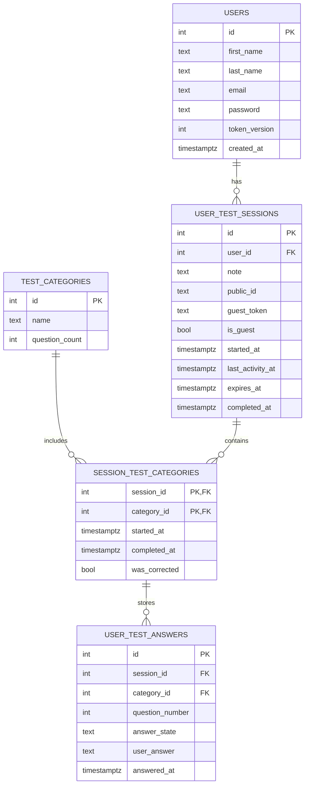

# Database

PostgreSQL database setup for the **TEKOS II screening application**. This folder contains the database initialization template, the SQL generation script, and a minimal local workflow for creating the final `init.sql` used by Docker Compose.

## Overview

The database layer is built around:

- a PostgreSQL container started by Docker Compose,
- a generated `init.sql` file mounted into `/docker-entrypoint-initdb.d/`,
- one admin database user defined by PostgreSQL environment variables,
- one separate application user used by the backend,
- a schema for users, screening sessions, session-category progress, and recorded answers.

The initialization SQL creates the application role if it does not already exist, grants database and schema access, creates the required tables, seeds the screening categories, and grants CRUD privileges on the main tables to the application user.

## Folder contents

- `generate_sql.sh` – loads variables from `database/.env` and generates `init.sql` from the template using `envsubst`
- `init.template.sql` – SQL template with placeholders for database and application credentials
- `README.md` – this documentation
- `.gitignore` – ignores `.env` and generated `.sql` files, while keeping `*.template.sql` tracked

## Required environment variables

Create a file at `database/.env` with these values:

```env
# PostgreSQL admin user
POSTGRES_USER=
POSTGRES_PASSWORD=
POSTGRES_DB=

# Application user used by the backend
APP_USER=
APP_PASSWORD=
```

## Quick start

### 1. Create the environment file

Create `database/.env` and fill in the variables shown above.

### 2. Generate `init.sql`

From the `database/` directory:

```bash
chmod +x generate_sql.sh
./generate_sql.sh
```

The script:

- resolves the current directory,
- loads variables from `database/.env`,
- substitutes placeholders in `init.template.sql`,
- writes the final output to `database/init.sql`.

### 3. Start the stack

From the repository root:

```bash
docker compose up --build
```

The `database` service mounts the generated file into the PostgreSQL initialization directory:

```yaml
./database/init.sql:/docker-entrypoint-initdb.d/init.sql:ro
```

## How initialization works

The generated SQL performs these steps:

1. Creates the application PostgreSQL role if it does not already exist.
2. Ensures the PostgreSQL admin role has superuser privileges.
3. Grants the application role access to the target database and `public` schema.
4. Grants table and sequence privileges, including default privileges for newly created objects.
5. Creates the application tables if they do not already exist.
6. Seeds the default test categories.
7. Creates indexes used for public session access, guest session access, and session activity lookup.

## Schema overview

### `users`

Stores registered users.

Main columns:

- `id`
- `first_name`
- `last_name`
- `email` (unique)
- `password`
- `token_version`
- `created_at`

### `test_categories`

Stores available screening categories and expected question counts.

Seeded values:

- `Marketplace` – 16
- `Mountains` – 7
- `Zoo` – 11
- `Street` – 13
- `Home` – 25
- `Parent_answerd` – 25

### `user_test_sessions`

Stores one screening session per attempt.

Main columns:

- `id`
- `user_id` – nullable, which allows guest sessions
- `note`
- `public_id`
- `guest_token`
- `is_guest`
- `started_at`
- `last_activity_at`
- `expires_at`
- `completed_at`

This table supports both authenticated and guest flows.

### `session_test_categories`

Tracks category-level progress inside a session.

Main columns:

- `session_id`
- `category_id`
- `started_at`
- `completed_at`
- `was_corrected`

Primary key:

- `(session_id, category_id)`

### `user_test_answers`

Stores answers for individual questions inside a session/category pair.

Main columns:

- `id`
- `session_id`
- `category_id`
- `question_number`
- `answer_state`
- `user_answer`
- `answered_at`

Constraints:

- foreign key to `session_test_categories (session_id, category_id)`
- unique combination of `(session_id, category_id, question_number)`
- `answer_state` limited to `'1'`, `'2'`, `'3'`, `'true'`, `'false'`

## Relationships



## Indexes and access patterns

The schema includes indexes for:

- `users.email`
- `user_test_sessions.public_id` (unique when not null)
- `user_test_sessions.guest_token` (unique when not null)
- `user_test_sessions.is_guest`
- `user_test_sessions.last_activity_at`

These support:

- email lookup,
- public session sharing or retrieval,
- guest session retrieval,
- guest/non-guest filtering,
- activity/expiry checks.

## Useful commands

Connect to PostgreSQL from the running container:

```bash
docker compose exec database psql -U "$POSTGRES_USER" -d "$POSTGRES_DB"
```

Open a shell inside the database container:

```bash
docker compose exec database sh
```

Re-generate the initialization script after changing credentials:

```bash
cd database
./generate_sql.sh
```

Recreate the database container and volume when you need a clean initialization:

```bash
docker compose down -v
docker compose up --build
```

## Notes

- `database/.env` is intentionally ignored by Git.
- Generated `.sql` files are ignored by Git.
- `init.template.sql` remains version-controlled so the schema can be edited safely without committing secrets.
- The database service uses a persistent Docker volume named `postgres_data`.

## Tech stack

- PostgreSQL
- Docker Compose
- Shell script generation with `envsubst`

## License

This project is distributed under the GNU AGPL v3.0 or later, consistent with the repository headers.
